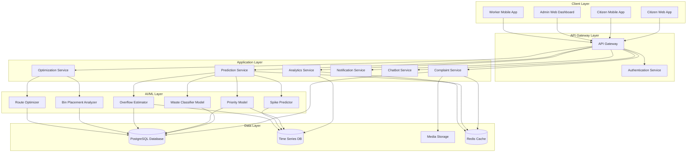
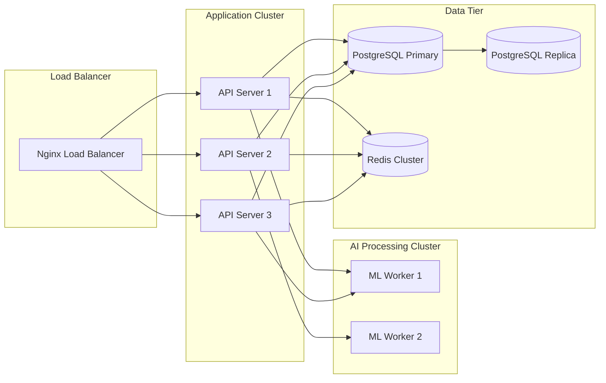

# Design Document: SwachhSaathi

## Overview

SwachhSaathi is a cloud-based waste management optimization platform that leverages AI and machine learning to improve municipal waste collection efficiency, reduce public health risks, and enhance citizen engagement. The system consists of five main subsystems:

1. **AI/ML Prediction Engine**: Classifies waste, predicts spikes, estimates overflow risks, and recommends priorities
2. **Optimization Engine**: Calculates optimal bin placements and collection routes
3. **Citizen Engagement Platform**: Handles complaints, status tracking, and chatbot interactions
4. **Admin Operations Platform**: Provides dashboards, analytics, and administrative chatbot
5. **Data Analytics Layer**: Processes patterns, generates insights, and calculates transparency scores

The system is designed for single-city deployment with architecture supporting future multi-city expansion.

## Architecture

### High-Level Architecture



### Technology Stack

**Frontend:**
- Web: React.js with TypeScript, Leaflet for maps, Chart.js for visualizations
- Mobile: React Native for cross-platform citizen and worker apps

**Backend:**
- API Gateway: Node.js with Express
- Services: Python (FastAPI) for AI/ML services, Node.js for business logic services
- Authentication: JWT with OAuth 2.0

**AI/ML:**
- Framework: TensorFlow/PyTorch for model training
- Image Classification: CNN-based model (ResNet or EfficientNet architecture)
- Prediction Models: Gradient Boosting (XGBoost/LightGBM) for tabular predictions
- NLP: Transformer-based model for chatbot (fine-tuned BERT or GPT)

**Data Storage:**
- Primary Database: PostgreSQL with PostGIS extension for geospatial data
- Time Series: TimescaleDB (PostgreSQL extension) for historical metrics
- Cache: Redis for session management and frequently accessed data
- Media Storage: AWS S3 or compatible object storage

**Infrastructure:**
- Containerization: Docker
- Orchestration: Kubernetes (for scalability)
- Message Queue: RabbitMQ for asynchronous processing
- Monitoring: Prometheus + Grafana

### Deployment Architecture



## Components and Interfaces

### 1. Waste Classifier Model

**Purpose:** Classify waste types from images/videos and assign risk levels.

**Input:**
- Image or video file (JPEG, PNG, MP4)
- Optional: Location metadata, timestamp

**Output:**
```typescript
interface WasteClassificationResult {
  categories: WasteCategory[];  // Array of detected categories
  riskLevel: 'LOW' | 'MEDIUM' | 'HIGH';
  confidence: number;  // 0.0 to 1.0
  boundingBoxes?: BoundingBox[];  // For object detection
  timestamp: Date;
}

interface WasteCategory {
  type: 'ORGANIC' | 'RECYCLABLE' | 'SANITARY' | 'HAZARDOUS' | 'MIXED';
  confidence: number;
  percentage: number;  // Estimated percentage of total waste
}
```

**Algorithm:**
1. Preprocess image (resize, normalize)
2. Pass through CNN backbone for feature extraction
3. Multi-label classification head outputs probabilities for each category
4. Apply threshold (0.3) to determine present categories
5. Calculate risk level based on category weights:
   - HAZARDOUS or SANITARY present → HIGH
   - MIXED with multiple categories → MEDIUM
   - Only ORGANIC → LOW
6. Return classification result with confidence scores

### 2. Priority Model

**Purpose:** Calculate cleaning priority scores for locations based on multiple factors.

**Input:**
```typescript
interface PriorityInput {
  locationId: string;
  wasteVolume: number;  // Estimated in cubic meters
  wasteRiskLevel: 'LOW' | 'MEDIUM' | 'HIGH';
  complaintCount: number;  // Last 7 days
  historicalAvgComplaints: number;
  daysSinceLastCleaning: number;
  kerbsideVisibility: boolean;
  sectorType: 'RESIDENTIAL' | 'COMMERCIAL' | 'INDUSTRIAL' | 'PUBLIC';
}
```

**Output:**
```typescript
interface PriorityScore {
  locationId: string;
  score: number;  // 0-100
  rank: number;  // Relative ranking
  factors: {
    wasteVolumeScore: number;
    riskScore: number;
    complaintScore: number;
    timeScore: number;
    visibilityScore: number;
  };
  recommendation: 'URGENT' | 'HIGH' | 'MEDIUM' | 'LOW';
}
```

**Algorithm:**
1. Calculate component scores (0-100 scale):
   - Waste Volume Score = min(100, (wasteVolume / binCapacity) * 100)
   - Risk Score = {LOW: 20, MEDIUM: 50, HIGH: 100}
   - Complaint Score = min(100, (complaintCount / historicalAvg) * 50)
   - Time Score = min(100, daysSinceLastCleaning * 10)
   - Visibility Score = kerbsideVisibility ? 30 : 0
2. Apply weighted sum:
   - score = (0.25 * wasteVolumeScore) + (0.30 * riskScore) + (0.20 * complaintScore) + (0.15 * timeScore) + (0.10 * visibilityScore)
3. Rank all locations by score
4. Assign recommendation level:
   - score >= 80 → URGENT
   - score >= 60 → HIGH
   - score >= 40 → MEDIUM
   - score < 40 → LOW

### 3. Spike Predictor

**Purpose:** Forecast unusual increases in waste volume.

**Input:**
```typescript
interface SpikePredictionInput {
  sectorId: string;
  historicalData: TimeSeriesData[];  // Last 12 months
  currentDate: Date;
  seasonalFactors: SeasonalFactor[];
}

interface TimeSeriesData {
  date: Date;
  wasteVolume: number;
  temperature: number;
  rainfall: number;
  eventType?: 'FESTIVAL' | 'MARRIAGE_SEASON' | 'HOLIDAY';
}
```

**Output:**
```typescript
interface SpikePrediction {
  sectorId: string;
  predictedDate: Date;
  predictedVolume: number;
  baselineVolume: number;
  spikePercentage: number;  // Percentage above baseline
  confidence: number;  // 0.0 to 1.0
  alertLevel: 'NONE' | 'WARNING' | 'CRITICAL';
  contributingFactors: string[];
}
```

**Algorithm:**
1. Decompose time series into trend, seasonal, and residual components
2. Calculate monthly baseline using moving average (3-month window)
3. Identify seasonal patterns:
   - Monsoon months: +15% wet waste
   - Festival periods: +25% plastic waste
   - Marriage season: +40% bulk waste
4. Train gradient boosting model on features:
   - Day of week, month, season
   - Historical volume (lag 1, 7, 30 days)
   - Weather data (temperature, rainfall)
   - Event flags
5. Generate prediction for next 30 days
6. Calculate spike percentage: ((predicted - baseline) / baseline) * 100
7. Assign alert level:
   - spikePercentage >= 62% → CRITICAL
   - spikePercentage >= 40% → WARNING
   - spikePercentage < 40% → NONE

### 4. Overflow Estimator

**Purpose:** Estimate probability of bin overflow.

**Input:**
```typescript
interface OverflowInput {
  binId: string;
  currentFillLevel: number;  // 0.0 to 1.0
  capacity: number;  // Liters
  fillRate: number;  // Liters per hour (estimated)
  hoursSinceLastCollection: number;
  historicalOverflows: number;  // Count in last 30 days
  wasteRiskLevel: 'LOW' | 'MEDIUM' | 'HIGH';
}
```

**Output:**
```typescript
interface OverflowEstimate {
  binId: string;
  overflowProbability: number;  // 0.0 to 1.0
  estimatedTimeToOverflow: number;  // Hours
  alertLevel: 'NONE' | 'WARNING' | 'CRITICAL';
  recommendedCollectionTime: Date;
}
```

**Algorithm:**
1. Calculate projected fill level:
   - projectedFill = currentFillLevel + (fillRate * hoursSinceLastCollection / capacity)
2. Calculate base probability using logistic function:
   - baseProbability = 1 / (1 + exp(-10 * (projectedFill - 0.85)))
3. Adjust for historical patterns:
   - historyFactor = min(1.5, 1 + (historicalOverflows / 10))
   - adjustedProbability = min(1.0, baseProbability * historyFactor)
4. Apply risk multiplier:
   - riskMultiplier = {LOW: 1.0, MEDIUM: 1.2, HIGH: 1.5}
   - finalProbability = min(1.0, adjustedProbability * riskMultiplier)
5. Estimate time to overflow:
   - remainingCapacity = capacity * (1.0 - currentFillLevel)
   - timeToOverflow = remainingCapacity / fillRate
6. Assign alert level:
   - finalProbability >= 0.148 → WARNING
   - finalProbability >= 0.50 → CRITICAL
   - Otherwise → NONE

### 5. Bin Placement Analyzer

**Purpose:** Recommend optimal bin locations.

**Input:**
```typescript
interface BinPlacementInput {
  sectorId: string;
  existingBins: BinLocation[];
  complaintLocations: Location[];  // Last 6 months
  populationDensity: DensityMap;
  accessibilityMap: AccessibilityMap;
}

interface BinLocation {
  binId: string;
  latitude: number;
  longitude: number;
  capacity: number;
  avgUtilization: number;  // 0.0 to 1.0
}
```

**Output:**
```typescript
interface BinPlacementRecommendation {
  sectorId: string;
  recommendations: PlacementSuggestion[];
  underservedAreas: Location[];
  overservedAreas: Location[];
}

interface PlacementSuggestion {
  latitude: number;
  longitude: number;
  priority: number;  // 0-100
  reason: string;
  estimatedImpact: {
    complaintReduction: number;  // Percentage
    coverageIncrease: number;  // Square meters
  };
}
```

**Algorithm:**
1. Create grid overlay of sector (100m x 100m cells)
2. For each cell, calculate demand score:
   - Complaint density (complaints within 200m radius)
   - Population density
   - Distance to nearest existing bin
   - demandScore = (0.4 * complaintDensity) + (0.3 * populationDensity) + (0.3 * distanceScore)
3. Identify underserved cells (demandScore > threshold AND distance > 300m)
4. For each underserved cell:
   - Check accessibility (road access, public space)
   - Calculate priority based on demand and accessibility
   - Estimate impact by simulating coverage improvement
5. Rank recommendations by priority
6. Identify overserved areas (multiple bins with low utilization < 0.4)

### 6. Route Optimizer

**Purpose:** Calculate optimal collection routes.

**Input:**
```typescript
interface RouteOptimizationInput {
  date: Date;
  vehicleCapacity: number;  // Cubic meters
  startLocation: Location;
  binsToCollect: BinCollectionTask[];
  trafficData: TrafficMap;
}

interface BinCollectionTask {
  binId: string;
  location: Location;
  estimatedVolume: number;
  priorityScore: number;
  overflowProbability: number;
  riskLevel: 'LOW' | 'MEDIUM' | 'HIGH';
}
```

**Output:**
```typescript
interface OptimizedRoute {
  routeId: string;
  sequence: BinCollectionTask[];
  totalDistance: number;  // Kilometers
  estimatedDuration: number;  // Minutes
  totalVolume: number;
  vehicleUtilization: number;  // 0.0 to 1.0
}
```

**Algorithm:**
1. Sort bins by priority (HIGH risk first, then by overflow probability)
2. Create initial route using nearest neighbor heuristic:
   - Start from depot
   - Select nearest unvisited high-priority bin
   - Continue until vehicle capacity reached or all bins visited
3. Apply 2-opt optimization to reduce distance:
   - For each pair of edges, try reversing the segment
   - Accept if total distance decreases
   - Repeat until no improvement
4. Validate constraints:
   - Total volume <= vehicle capacity
   - Route duration <= shift duration (8 hours)
5. Calculate metrics:
   - Sum distances between consecutive stops
   - Estimate duration using traffic data (distance / avgSpeed + stopTime)
   - Calculate utilization (totalVolume / vehicleCapacity)

### 7. Complaint Service

**Purpose:** Handle citizen complaint submission and tracking.

**API Endpoints:**

```typescript
// Submit complaint
POST /api/complaints
Request: {
  citizenId: string;
  location: {
    latitude: number;
    longitude: number;
    address: string;
  };
  description: string;
  category: 'OVERFLOW' | 'ILLEGAL_DUMPING' | 'MISSED_COLLECTION' | 'HAZARDOUS' | 'OTHER';
  images?: File[];
  priority: 'LOW' | 'MEDIUM' | 'HIGH';
}
Response: {
  complaintId: string;
  status: 'SUBMITTED';
  estimatedResolutionTime: Date;
  trackingUrl: string;
}

// Get complaint status
GET /api/complaints/{complaintId}
Response: {
  complaintId: string;
  status: 'SUBMITTED' | 'ACKNOWLEDGED' | 'IN_PROGRESS' | 'RESOLVED' | 'CLOSED';
  submittedAt: Date;
  acknowledgedAt?: Date;
  resolvedAt?: Date;
  assignedTo?: string;
  resolutionNotes?: string;
  timeline: StatusUpdate[];
}

// Update complaint status (admin/worker)
PATCH /api/complaints/{complaintId}/status
Request: {
  status: 'ACKNOWLEDGED' | 'IN_PROGRESS' | 'RESOLVED';
  notes?: string;
  images?: File[];
}
```

**Business Logic:**
1. Validate location within service area
2. Check for duplicate complaints (same location within 50m, last 24 hours)
3. Auto-categorize using NLP if description provided
4. Assign priority based on category and AI classification of images
5. Create notification for relevant sector supervisor
6. Award credits to citizen upon submission
7. Schedule escalation if not acknowledged within 2 hours

### 8. Chatbot Service

**Purpose:** Provide conversational interface for citizens and admins.

**Architecture:**
- Intent Recognition: Fine-tuned BERT model for intent classification
- Entity Extraction: Named Entity Recognition for locations, bin IDs, dates
- Dialog Management: Rule-based state machine with context tracking
- Response Generation: Template-based with dynamic data injection

**Citizen Chatbot Intents:**

```typescript
interface CitizenIntent {
  WASTE_DISPOSAL_GUIDE: {
    entities: { wasteType: string };
    response: string;  // Category-specific instructions
  };
  COMPLAINT_STATUS: {
    entities: { complaintId: string };
    response: ComplaintStatus;
  };
  NEAREST_BIN: {
    entities: { location: Location };
    response: BinLocation[];
  };
  COLLECTION_SCHEDULE: {
    entities: { address: string };
    response: CollectionSchedule;
  };
}
```

**Admin Chatbot Intents:**

```typescript
interface AdminIntent {
  OVERFLOW_RISK_QUERY: {
    entities: { sectorId?: string; limit?: number };
    response: OverflowEstimate[];
  };
  URGENT_BINS: {
    entities: { limit: number };
    response: PriorityScore[];
  };
  SECTOR_STATS: {
    entities: { sectorId: string; timeRange: string };
    response: SectorStatistics;
  };
  COMPLAINT_SUMMARY: {
    entities: { timeRange: string; category?: string };
    response: ComplaintSummary;
  };
}
```

**Processing Flow:**
1. Receive user message
2. Tokenize and pass through intent classifier
3. Extract entities using NER model
4. Validate entities and fetch required data
5. Generate response using template + data
6. Track conversation context for multi-turn dialogs
7. Escalate to human if confidence < 0.7

### 9. Analytics Service

**Purpose:** Calculate metrics, generate reports, and provide insights.

**Key Metrics:**

```typescript
interface TransparencyScore {
  overall: number;  // 0-100
  components: {
    avgResolutionTime: number;  // Hours
    targetResolutionTime: number;  // Hours
    resolutionScore: number;  // 0-100
    
    overflowIncidents: number;  // Per month
    targetOverflows: number;
    overflowScore: number;  // 0-100
    
    avgResponseTime: number;  // Minutes
    targetResponseTime: number;  // Minutes
    responseScore: number;  // 0-100
  };
  trend: 'IMPROVING' | 'STABLE' | 'DECLINING';
}

interface SectorStatistics {
  sectorId: string;
  timeRange: { start: Date; end: Date };
  metrics: {
    totalWasteVolume: number;
    avgDailyVolume: number;
    peakVolume: number;
    peakTime: string;
    dominantWasteType: string;
    complaintCount: number;
    resolutionRate: number;
    avgResolutionTime: number;
  };
  comparison: {
    vsLastPeriod: number;  // Percentage change
    vsCityAverage: number;  // Percentage difference
  };
}
```

**Transparency Score Calculation:**
1. Resolution Score:
   - resolutionScore = max(0, 100 - ((avgResolutionTime - targetResolutionTime) / targetResolutionTime * 100))
2. Overflow Score:
   - overflowScore = max(0, 100 - ((overflowIncidents - targetOverflows) / targetOverflows * 100))
3. Response Score:
   - responseScore = max(0, 100 - ((avgResponseTime - targetResponseTime) / targetResponseTime * 100))
4. Overall Score:
   - overall = (resolutionScore * 0.4) + (overflowScore * 0.35) + (responseScore * 0.25)
5. Trend:
   - Compare current score with last 3 periods
   - IMPROVING if increasing > 5%
   - DECLINING if decreasing > 5%
   - STABLE otherwise

### 10. Credit System

**Purpose:** Reward citizen participation through challenge-based credits.

**Credit Rules:**

```typescript
interface CreditRule {
  action: string;
  baseCredits: number;
  multipliers: {
    verified: number;  // 1.5x if complaint verified
    resolved: number;  // 2.0x if resolved within target time
    highPriority: number;  // 1.3x for high-priority issues
    firstReport: number;  // 1.5x for being first to report
  };
}

const CREDIT_RULES: CreditRule[] = [
  { action: 'SUBMIT_COMPLAINT', baseCredits: 10, multipliers: {...} },
  { action: 'SUBMIT_WITH_IMAGE', baseCredits: 15, multipliers: {...} },
  { action: 'REPORT_HAZARDOUS', baseCredits: 25, multipliers: {...} },
  { action: 'REPORT_ILLEGAL_DUMPING', baseCredits: 20, multipliers: {...} },
];
```

**Anti-Gaming Measures:**
1. Limit complaints per citizen per day (max 5)
2. Verify complaint authenticity using image classification
3. Check for duplicate reports (same location, similar time)
4. Penalize false reports (deduct credits)
5. Require minimum time between complaints from same citizen (30 minutes)

**Leaderboard Calculation:**
```typescript
interface LeaderboardEntry {
  citizenId: string;
  name: string;
  totalCredits: number;
  rank: number;
  validComplaints: number;
  resolvedComplaints: number;
  badges: Badge[];
}

// Rankings: City-wide and per sector
// Updated: Real-time with Redis cache
// Display: Top 100 citizens
```

## Data Models

### Core Entities

```typescript
// Bin
interface Bin {
  id: string;
  location: {
    latitude: number;
    longitude: number;
    address: string;
  };
  sectorId: string;
  capacity: number;  // Liters
  type: 'GENERAL' | 'RECYCLABLE' | 'ORGANIC' | 'HAZARDOUS';
  status: 'ACTIVE' | 'MAINTENANCE' | 'REMOVED';
  installDate: Date;
  lastCollectionDate?: Date;
  avgUtilization: number;
  metadata: {
    manufacturer?: string;
    model?: string;
    sensorEnabled: boolean;
  };
}

// Complaint
interface Complaint {
  id: string;
  citizenId: string;
  location: {
    latitude: number;
    longitude: number;
    address: string;
  };
  sectorId: string;
  category: 'OVERFLOW' | 'ILLEGAL_DUMPING' | 'MISSED_COLLECTION' | 'HAZARDOUS' | 'OTHER';
  description: string;
  priority: 'LOW' | 'MEDIUM' | 'HIGH';
  status: 'SUBMITTED' | 'ACKNOWLEDGED' | 'IN_PROGRESS' | 'RESOLVED' | 'CLOSED';
  submittedAt: Date;
  acknowledgedAt?: Date;
  assignedTo?: string;
  resolvedAt?: Date;
  resolutionNotes?: string;
  images: string[];  // URLs
  aiClassification?: WasteClassificationResult;
  creditsAwarded: number;
}

// Collection Task
interface CollectionTask {
  id: string;
  binId: string;
  routeId: string;
  assignedTo: string;  // Worker ID
  scheduledDate: Date;
  status: 'PENDING' | 'EN_ROUTE' | 'IN_PROGRESS' | 'COMPLETED' | 'FAILED';
  priorityScore: number;
  estimatedVolume: number;
  actualVolume?: number;
  startTime?: Date;
  completionTime?: Date;
  notes?: string;
  images?: string[];
}

// Sector
interface Sector {
  id: string;
  name: string;
  type: 'RESIDENTIAL' | 'COMMERCIAL' | 'INDUSTRIAL' | 'PUBLIC';
  boundary: GeoJSON.Polygon;
  population: number;
  area: number;  // Square kilometers
  binCount: number;
  supervisorId: string;
  metadata: {
    avgWastePerDay: number;
    dominantWasteType: string;
    cleaningFrequency: 'DAILY' | 'ALTERNATE' | 'EVERY_3_DAYS';
  };
}

// User
interface User {
  id: string;
  email: string;
  phone: string;
  name: string;
  role: 'SUPER_ADMIN' | 'MUNICIPAL_ADMIN' | 'SECTOR_SUPERVISOR' | 'COLLECTION_WORKER' | 'CITIZEN';
  sectorId?: string;  // For sector-specific roles
  status: 'ACTIVE' | 'INACTIVE' | 'SUSPENDED';
  createdAt: Date;
  lastLoginAt?: Date;
  metadata: {
    credits?: number;  // For citizens
    completedTasks?: number;  // For workers
  };
}

// Route
interface Route {
  id: string;
  name: string;
  sectorId: string;
  vehicleId: string;
  driverId: string;
  scheduledDate: Date;
  status: 'PLANNED' | 'IN_PROGRESS' | 'COMPLETED' | 'CANCELLED';
  sequence: string[];  // Array of bin IDs
  totalDistance: number;
  estimatedDuration: number;
  actualDuration?: number;
  startTime?: Date;
  completionTime?: Date;
}
```

### Time Series Data

```typescript
// Waste Volume History
interface WasteVolumeRecord {
  timestamp: Date;
  binId: string;
  sectorId: string;
  volume: number;
  fillLevel: number;  // 0.0 to 1.0
  wasteType: string;
  riskLevel: 'LOW' | 'MEDIUM' | 'HIGH';
}

// System Metrics
interface SystemMetric {
  timestamp: Date;
  metricType: 'COMPLAINT_COUNT' | 'RESOLUTION_TIME' | 'OVERFLOW_INCIDENT' | 'COLLECTION_COUNT';
  value: number;
  sectorId?: string;
  metadata: Record<string, any>;
}
```

### Database Schema Design

**PostgreSQL Tables:**
- users (id, email, phone, name, role, sector_id, status, created_at, metadata)
- sectors (id, name, type, boundary, population, area, supervisor_id, metadata)
- bins (id, location, sector_id, capacity, type, status, install_date, last_collection_date, metadata)
- complaints (id, citizen_id, location, sector_id, category, description, priority, status, submitted_at, assigned_to, resolved_at, images, ai_classification, credits_awarded)
- collection_tasks (id, bin_id, route_id, assigned_to, scheduled_date, status, priority_score, estimated_volume, actual_volume, start_time, completion_time, notes)
- routes (id, name, sector_id, vehicle_id, driver_id, scheduled_date, status, sequence, total_distance, estimated_duration, actual_duration)
- credits_ledger (id, citizen_id, action, credits, multiplier, timestamp, complaint_id)
- media_files (id, url, type, entity_type, entity_id, uploaded_at, metadata)

**TimescaleDB Hypertables:**
- waste_volume_history (timestamp, bin_id, sector_id, volume, fill_level, waste_type, risk_level)
- system_metrics (timestamp, metric_type, value, sector_id, metadata)

**Indexes:**
- bins: (sector_id), (location) using GIST
- complaints: (citizen_id), (sector_id), (status), (submitted_at)
- collection_tasks: (assigned_to), (scheduled_date), (status)
- waste_volume_history: (bin_id, timestamp), (sector_id, timestamp)


## Correctness Properties

*A property is a characteristic or behavior that should hold true across all valid executions of a system—essentially, a formal statement about what the system should do. Properties serve as the bridge between human-readable specifications and machine-verifiable correctness guarantees.*

### Waste Classification Properties

**Property 1: Waste Category Validity**
*For any* image or video input to the Waste_Classifier, the output categories must be from the valid set {ORGANIC, RECYCLABLE, SANITARY, HAZARDOUS, MIXED}.
**Validates: Requirements 1.1**

**Property 2: Multi-Category Detection**
*For any* waste image containing multiple distinct waste types, the Waste_Classifier should identify all present categories and include MIXED in the category list.
**Validates: Requirements 1.2**

**Property 3: Risk Level Completeness and Correctness**
*For any* waste classification result, a Risk_Level must be assigned, and the assignment must follow these rules: (1) if HAZARDOUS or SANITARY is present, Risk_Level = HIGH, (2) if only ORGANIC is present, Risk_Level = LOW, (3) otherwise Risk_Level = MEDIUM or HIGH based on composition.
**Validates: Requirements 1.3, 1.4, 1.5**

### Priority and Prediction Properties

**Property 4: Priority Score Input Sensitivity**
*For any* location, changing any of the input factors (waste volume, risk level, complaint frequency, days since cleaning, visibility) should affect the priority score calculation.
**Validates: Requirements 2.1**

**Property 5: Priority Score Monotonicity**
*For any* two locations with identical factors except one has higher risk level or higher complaint frequency, the location with the higher risk or more complaints must have a higher priority score.
**Validates: Requirements 2.2, 2.3**

**Property 6: Priority Ranking Consistency**
*For any* set of locations, if location A has a higher priority score than location B, then A must rank higher than B in the priority list.
**Validates: Requirements 2.4**

**Property 7: Priority Score Reactivity**
*For any* location, when new data (complaints, waste volume, classification) is added, recalculating the priority score should potentially produce a different value than before the data was added.
**Validates: Requirements 2.5**

**Property 8: Spike Alert Threshold**
*For any* waste volume prediction, if the predicted volume exceeds 162% of the monthly baseline (62% above average), a spike alert with level WARNING or CRITICAL must be generated.
**Validates: Requirements 3.2**

**Property 9: Seasonal Adjustment Impact**
*For any* prediction during a known seasonal period (monsoon, festival, marriage season), the predicted volume should differ from a prediction made without seasonal factors, all else being equal.
**Validates: Requirements 3.3**

**Property 10: Prediction Completeness**
*For any* spike prediction or overflow estimate, the result must include a confidence level or probability value between 0.0 and 1.0.
**Validates: Requirements 3.5, 5.4**

### Optimization Properties

**Property 11: Bin Placement Input Consideration**
*For any* bin placement analysis, changing the input data (complaint locations, population density, existing bin locations) should affect the recommended placements.
**Validates: Requirements 4.1**

**Property 12: Placement Recommendation Completeness**
*For any* bin placement recommendation, the output must include a justification string and an estimated impact on collection efficiency.
**Validates: Requirements 4.2, 4.5**

**Property 13: Underserved Area Detection**
*For any* area where (complaint density > threshold) AND (distance to nearest bin > 300m), the Bin_Placement_Analyzer should identify it as underserved.
**Validates: Requirements 4.4**

**Property 14: Overflow Alert Threshold**
*For any* bin with overflow probability >= 0.148 (14.80%), the system must generate a warning or critical alert.
**Validates: Requirements 5.2**

**Property 15: Overflow Risk Escalation**
*For any* two bins with equal overflow probability, the bin containing HIGH risk waste must have higher alert priority than the bin with LOW risk waste.
**Validates: Requirements 5.3**

**Property 16: Route Capacity Constraint**
*For any* generated collection route, the sum of estimated volumes for all bins in the route must not exceed the vehicle capacity.
**Validates: Requirements 6.4**

**Property 17: Route Priority Ordering**
*For any* collection route containing both HIGH risk bins and LOW risk bins, the HIGH risk bins should appear earlier in the sequence (lower index) than LOW risk bins with similar overflow probability.
**Validates: Requirements 6.2**

**Property 18: Route Optimality**
*For any* generated route, the total distance should be less than or equal to a naive route visiting bins in random order (averaged over multiple random orderings).
**Validates: Requirements 6.3**

### Complaint Management Properties

**Property 19: Complaint ID Uniqueness**
*For any* two complaints submitted to the system, they must be assigned different complaint IDs.
**Validates: Requirements 7.2**

**Property 20: Complaint Data Completeness**
*For any* submitted complaint, the stored record must include location (latitude, longitude), description, timestamp, and status.
**Validates: Requirements 7.1, 7.3**

**Property 21: Complaint Status Validity**
*For any* complaint in the system, its status must be one of {SUBMITTED, ACKNOWLEDGED, IN_PROGRESS, RESOLVED, CLOSED}.
**Validates: Requirements 7.4**

**Property 22: Resolution Notification**
*For any* complaint that transitions to RESOLVED status, a notification must be sent to the citizen who submitted it.
**Validates: Requirements 7.5**

**Property 23: Complaint Escalation**
*For any* complaint that remains in SUBMITTED or ACKNOWLEDGED status for longer than the expected resolution time, its priority score should be higher than when it was first submitted.
**Validates: Requirements 7.6**

### Chatbot Properties

**Property 24: Chatbot Query Response**
*For any* valid waste category query to the citizen chatbot, the response must contain disposal instructions specific to that category.
**Validates: Requirements 8.1**

**Property 25: Complaint Status Retrieval**
*For any* valid complaint ID query to the chatbot, the response must include the current status of that complaint.
**Validates: Requirements 8.3**

**Property 26: Low Confidence Escalation**
*For any* chatbot query where the intent classification confidence is below 0.7, the system should escalate to human support.
**Validates: Requirements 8.5**

**Property 27: Admin Chatbot Sector Filtering**
*For any* admin chatbot query specifying a sector ID, all returned results must belong to that sector only.
**Validates: Requirements 9.3**

**Property 28: Admin Chatbot Historical Data Access**
*For any* admin chatbot query requesting historical trends, the response must include data from the time range specified in the query.
**Validates: Requirements 9.5**

### Dashboard and Visualization Properties

**Property 29: Heatmap Color Mapping**
*For any* two sectors displayed on the heatmap, if sector A has higher waste volume than sector B, then sector A's color intensity must be greater than sector B's.
**Validates: Requirements 10.2**

**Property 30: Bin Map Completeness**
*For any* bin in the active status in the database, it must appear on the geospatial map in the admin dashboard.
**Validates: Requirements 10.3**

**Property 31: Bin Detail Completeness**
*For any* bin selected on the map, the displayed information must include fill level, risk level, last collection time, and overflow probability.
**Validates: Requirements 10.4**

**Property 32: Sector Data Isolation**
*For any* sector-specific view in the dashboard, all displayed data (bins, complaints, metrics) must belong only to that sector.
**Validates: Requirements 10.7**

### Credit System Properties

**Property 33: Credit Award on Submission**
*For any* valid complaint submission, the citizen must be awarded credits, and the amount should be proportional to the issue severity (HIGH > MEDIUM > LOW).
**Validates: Requirements 11.1**

**Property 34: Bonus Credit for Resolution**
*For any* complaint that is both verified and resolved, the total credits awarded must be greater than the base submission credits.
**Validates: Requirements 11.2**

**Property 35: Leaderboard Ranking Consistency**
*For any* two citizens on the leaderboard, if citizen A has more total credits than citizen B, then A's rank must be lower (better) than B's rank.
**Validates: Requirements 11.3**

**Property 36: Leaderboard Entry Completeness**
*For any* citizen appearing on the leaderboard, their entry must include rank, total credits, and contribution statistics.
**Validates: Requirements 11.4**

**Property 37: Milestone Recognition**
*For any* citizen whose credit total crosses a defined milestone threshold, an achievement recognition must be generated.
**Validates: Requirements 11.6**

### Access Control Properties

**Property 38: Authentication and Authorization**
*For any* user login attempt, the system must authenticate the credentials and assign permissions matching the user's role.
**Validates: Requirements 12.2**

**Property 39: Sector Supervisor Data Restriction**
*For any* user with role SECTOR_SUPERVISOR, all data access queries must be filtered to return only data from their assigned sector.
**Validates: Requirements 12.4**

**Property 40: Citizen Access Restriction**
*For any* user with role CITIZEN, attempts to access admin-only endpoints (dashboard analytics, route management, user management) must be denied.
**Validates: Requirements 12.5**

**Property 41: Access Logging**
*For any* user access attempt or administrative action, a log entry must be created with timestamp, user ID, action type, and result.
**Validates: Requirements 12.6**

### Analytics Properties

**Property 42: Sector Metrics Completeness**
*For any* sector analysis, the output must include average waste volume, peak times, and dominant waste type for that sector.
**Validates: Requirements 13.1**

**Property 43: Above-Average Sector Identification**
*For any* sector whose average waste volume exceeds the city-wide average, it must be included in the above-average sectors list.
**Validates: Requirements 13.2**

**Property 44: Pattern Change Alerting**
*For any* sector where the current period's waste volume differs from the historical average by more than a threshold percentage (e.g., 30%), an alert must be generated.
**Validates: Requirements 13.4**

**Property 45: Seasonal Prediction Generation**
*For any* upcoming seasonal period (within next 30 days), the system must generate waste volume predictions for affected sectors.
**Validates: Requirements 14.2**

**Property 46: Seasonal Frequency Adjustment**
*For any* location during a high-waste season, the recommended cleaning frequency should be higher than or equal to the frequency recommended for the same location during a normal period.
**Validates: Requirements 14.3**

**Property 47: Seasonal Prediction Confidence**
*For any* seasonal prediction, the output must include confidence intervals (lower bound and upper bound).
**Validates: Requirements 14.4**

### Cleaning Frequency Properties

**Property 48: Frequency Input Sensitivity**
*For any* location, changing the input factors (waste generation rate, bin capacity, overflow history, seasonal patterns) should affect the recommended cleaning frequency.
**Validates: Requirements 15.1**

**Property 49: Frequency Category Validity**
*For any* cleaning frequency recommendation, the value must be one of {DAILY, ALTERNATE_DAY, EVERY_3_DAYS}.
**Validates: Requirements 15.2**

**Property 50: Frequency Reactivity**
*For any* location where waste patterns change significantly (e.g., volume increases by 50%), recalculating the frequency recommendation should potentially produce a different value.
**Validates: Requirements 15.3**

**Property 51: High-Risk Frequency Increase**
*For any* two locations with similar waste generation rates, the location with HIGH risk waste must have a cleaning frequency greater than or equal to the location with LOW risk waste.
**Validates: Requirements 15.4**

**Property 52: Frequency Justification Completeness**
*For any* cleaning frequency recommendation, the output must include a justification string explaining the reasoning.
**Validates: Requirements 15.5**

### Transparency and Reporting Properties

**Property 53: Transparency Score Calculation**
*For any* transparency score calculation, the inputs (resolution time, overflow frequency, response time) must affect the final score value.
**Validates: Requirements 16.1**

**Property 54: Transparency Score Component Display**
*For any* displayed transparency score, the output must include the component metrics: average resolution time, overflow incidents per month, and average response time.
**Validates: Requirements 16.2**

**Property 55: Transparency Score Levels**
*For any* sector and for the city-wide level, a transparency score must be calculable.
**Validates: Requirements 16.3**

**Property 56: Transparency Score Decline Analysis**
*For any* transparency score that decreases by more than 5% compared to the previous period, the output must include contributing factors explaining the decline.
**Validates: Requirements 16.4**

**Property 57: Awareness Campaign Targeting**
*For any* sector where the rate of improper waste disposal complaints exceeds a threshold, that sector must be flagged for awareness campaigns.
**Validates: Requirements 17.1**

**Property 58: High-Risk Area Flagging**
*For any* geographic area where HIGH risk waste is detected more than N times in a period, that area must be flagged for awareness campaigns.
**Validates: Requirements 17.2**

**Property 59: Campaign Topic Recommendation**
*For any* awareness campaign recommendation, the suggested topics must be based on the types of violations found in that area (e.g., if hazardous waste is common, recommend hazardous disposal education).
**Validates: Requirements 17.4**

**Property 60: Campaign Effectiveness Tracking**
*For any* area where an awareness campaign was conducted, the system must be able to compare complaint patterns before and after the campaign.
**Validates: Requirements 17.5**

### Hazard Control Properties

**Property 61: Hazardous Waste Alert**
*For any* waste classification result with HAZARDOUS category, an immediate alert must be sent to designated health and safety personnel.
**Validates: Requirements 18.1**

**Property 62: Hazardous Incident Logging**
*For any* hazardous waste detection, a log entry must be created including location, waste type, and resolution status.
**Validates: Requirements 18.2**

**Property 63: Illegal Dumping Site Detection**
*For any* geographic area with more than N hazardous waste incidents within radius R in time period T, the area must be flagged as a potential illegal dumping site.
**Validates: Requirements 18.3**

**Property 64: Hazardous Waste Time Tracking**
*For any* hazardous waste incident, the system must track and store the time from detection to safe removal.
**Validates: Requirements 18.4**

**Property 65: Hazardous Removal Escalation**
*For any* hazardous waste incident where (current time - detection time) exceeds the target removal time, the alert priority must be escalated.
**Validates: Requirements 18.5**

### Policy and Reporting Properties

**Property 66: Policy Report Completeness**
*For any* generated policy report, it must include year-over-year comparisons and trend analysis.
**Validates: Requirements 19.2**

**Property 67: Budget Impact Estimation**
*For any* proposed operational change (adding bins, changing frequency, modifying routes), the system must calculate and return an estimated budget impact.
**Validates: Requirements 19.4**

### Performance Properties

**Property 68: AI Processing Time Bound**
*For any* city-wide AI model prediction request, the processing must complete within 5 minutes (300 seconds).
**Validates: Requirements 20.2**

**Property 69: Multi-Tenant Data Isolation**
*For any* multi-city deployment, querying data for city A must never return data belonging to city B.
**Validates: Requirements 20.5**

### Status Tracking Properties

**Property 70: Task Display Completeness**
*For any* collection task assigned to a worker, the mobile interface must display task details including bin location, priority, and estimated volume.
**Validates: Requirements 21.1**

**Property 71: Status Update Persistence**
*For any* worker status update (EN_ROUTE, ARRIVED, IN_PROGRESS, COMPLETED), the new status must be immediately reflected in the central database.
**Validates: Requirements 21.2**

**Property 72: Task Completion Timestamp**
*For any* task marked as COMPLETED, the database record must include a completion timestamp and any related complaints must be updated.
**Validates: Requirements 21.3**

**Property 73: Status Change Notification**
*For any* task status change, notifications must be sent to all relevant stakeholders (supervisor, citizen who complained, etc.).
**Validates: Requirements 21.4**

**Property 74: Issue Reporting Capability**
*For any* task where a worker reports an issue, the system must accept and store the issue report with a reason code.
**Validates: Requirements 21.5**

### Media Management Properties

**Property 75: Media Upload Validation**
*For any* image or video upload, the system must validate file format, size, and content before accepting it.
**Validates: Requirements 22.1**

**Property 76: Compression Preserves Classification**
*For any* waste image, if the original image is classifiable by the Waste_Classifier, then the compressed version must also be classifiable with similar accuracy (within 10% confidence difference).
**Validates: Requirements 22.2**

**Property 77: Media Association Requirement**
*For any* stored media file, it must be associated with at least one entity (complaint ID, bin ID, or location).
**Validates: Requirements 22.3**

**Property 78: Privacy Protection Application**
*For any* media file containing detected faces or license plates, the stored version must have those elements blurred or obscured.
**Validates: Requirements 22.5**


## Error Handling

### Error Categories

**1. Input Validation Errors**
- Invalid file formats for images/videos
- Out-of-bounds coordinates (latitude/longitude)
- Missing required fields in API requests
- Invalid enum values (status, category, role)

**Handling Strategy:**
- Return HTTP 400 Bad Request with detailed error message
- Log validation failures for monitoring
- Provide clear guidance on correct format

**2. Authentication and Authorization Errors**
- Invalid credentials
- Expired tokens
- Insufficient permissions for requested operation
- Accessing data outside assigned sector

**Handling Strategy:**
- Return HTTP 401 Unauthorized for authentication failures
- Return HTTP 403 Forbidden for authorization failures
- Log all failed access attempts for security monitoring
- Do not reveal whether user exists (prevent enumeration)

**3. Resource Not Found Errors**
- Complaint ID doesn't exist
- Bin ID doesn't exist
- User ID doesn't exist
- Sector ID doesn't exist

**Handling Strategy:**
- Return HTTP 404 Not Found with generic message
- Log requests for non-existent resources
- Suggest similar valid resources if applicable

**4. AI Model Errors**
- Image too blurry for classification
- Video format not supported
- Model inference timeout
- Confidence below minimum threshold

**Handling Strategy:**
- Return HTTP 422 Unprocessable Entity with specific reason
- Provide fallback classification (MIXED with LOW confidence)
- Log model failures for retraining consideration
- Queue for manual review if critical (hazardous waste suspected)

**5. Data Consistency Errors**
- Concurrent updates to same resource
- Constraint violations (unique ID, foreign key)
- Invalid state transitions (e.g., RESOLVED → SUBMITTED)

**Handling Strategy:**
- Use optimistic locking with version numbers
- Return HTTP 409 Conflict for concurrent modification
- Validate state transitions before applying
- Rollback transactions on constraint violations

**6. External Service Errors**
- Map service unavailable
- Notification service failure
- Storage service timeout
- Weather API unavailable

**Handling Strategy:**
- Implement retry logic with exponential backoff (3 attempts)
- Use circuit breaker pattern to prevent cascade failures
- Degrade gracefully (e.g., skip weather data if unavailable)
- Queue notifications for retry if delivery fails
- Return HTTP 503 Service Unavailable if critical service down

**7. Performance and Resource Errors**
- Database connection pool exhausted
- Memory limit exceeded during large query
- Request timeout (> 30 seconds)
- Rate limit exceeded

**Handling Strategy:**
- Return HTTP 429 Too Many Requests with Retry-After header
- Return HTTP 504 Gateway Timeout for slow operations
- Implement request queuing for expensive operations
- Use pagination for large result sets
- Monitor resource usage and scale proactively

### Error Response Format

All API errors follow consistent JSON structure:

```typescript
interface ErrorResponse {
  error: {
    code: string;  // Machine-readable error code
    message: string;  // Human-readable message
    details?: any;  // Additional context
    timestamp: string;
    requestId: string;  // For tracing
  };
}
```

### Logging Strategy

**Log Levels:**
- ERROR: System failures, unhandled exceptions, data corruption
- WARN: Degraded performance, fallback usage, retry attempts
- INFO: Successful operations, state changes, user actions
- DEBUG: Detailed execution flow, variable values

**Structured Logging:**
```typescript
{
  timestamp: "2024-01-15T10:30:00Z",
  level: "ERROR",
  service: "prediction-service",
  requestId: "req-123",
  userId: "user-456",
  message: "Waste classification failed",
  error: {
    type: "ModelInferenceError",
    stack: "...",
  },
  context: {
    imageId: "img-789",
    modelVersion: "v2.3.1"
  }
}
```

### Monitoring and Alerts

**Key Metrics to Monitor:**
- API error rate (target: < 1%)
- AI model accuracy (target: > 90%)
- Average response time (target: < 500ms for API, < 5min for predictions)
- Database connection pool usage (alert if > 80%)
- Failed notification delivery rate (target: < 5%)
- Hazardous waste alert delivery time (target: < 30 seconds)

**Alert Thresholds:**
- CRITICAL: Hazardous waste alert not delivered within 1 minute
- CRITICAL: System error rate > 5% for 5 minutes
- HIGH: AI model accuracy drops below 85%
- HIGH: Database connection pool > 90% for 2 minutes
- MEDIUM: Average API response time > 1 second for 10 minutes
- MEDIUM: Failed notification rate > 10% for 15 minutes

## Testing Strategy

### Dual Testing Approach

SwachhSaathi requires both unit testing and property-based testing for comprehensive coverage:

**Unit Tests:** Verify specific examples, edge cases, and error conditions
**Property Tests:** Verify universal properties across all inputs

Together, these approaches provide comprehensive coverage where unit tests catch concrete bugs and property tests verify general correctness.

### Property-Based Testing

**Framework:** Use `fast-check` for JavaScript/TypeScript services and `Hypothesis` for Python AI/ML services.

**Configuration:**
- Minimum 100 iterations per property test (due to randomization)
- Each property test must reference its design document property
- Tag format: `Feature: swachhsaathi, Property {number}: {property_text}`

**Example Property Test Structure:**

```typescript
// Feature: swachhsaathi, Property 1: Waste Category Validity
describe('Waste Classification Properties', () => {
  it('should return valid waste categories for any image', async () => {
    await fc.assert(
      fc.asyncProperty(
        fc.record({
          imageData: fc.uint8Array({ minLength: 1000, maxLength: 100000 }),
          format: fc.constantFrom('JPEG', 'PNG'),
        }),
        async (input) => {
          const result = await wasteClassifier.classify(input);
          const validCategories = ['ORGANIC', 'RECYCLABLE', 'SANITARY', 'HAZARDOUS', 'MIXED'];
          
          expect(result.categories).toBeDefined();
          result.categories.forEach(cat => {
            expect(validCategories).toContain(cat.type);
          });
        }
      ),
      { numRuns: 100 }
    );
  });
});
```

### Unit Testing Strategy

**Test Organization:**
- Group tests by component/service
- Use descriptive test names following "should [expected behavior] when [condition]" pattern
- Mock external dependencies (database, external APIs)
- Use test fixtures for common data setups

**Coverage Targets:**
- Code coverage: > 80% for business logic
- Branch coverage: > 75%
- Critical paths (hazard alerts, authentication): 100%

**Key Unit Test Areas:**

1. **API Endpoints:**
   - Valid request handling
   - Invalid input rejection
   - Authentication/authorization
   - Error responses

2. **Business Logic:**
   - Priority score calculation with specific inputs
   - Risk level assignment for known waste types
   - Credit calculation for different scenarios
   - State transitions (complaint status, task status)

3. **Data Access:**
   - CRUD operations
   - Query filtering
   - Transaction rollback
   - Constraint enforcement

4. **Integration Points:**
   - AI model invocation
   - Notification sending
   - File storage operations
   - External API calls

### Integration Testing

**Scope:** Test interactions between components without mocking internal services.

**Key Integration Tests:**
1. Complaint submission → AI classification → Priority calculation → Route optimization
2. Worker status update → Database update → Citizen notification
3. Hazardous waste detection → Alert generation → Notification delivery
4. Dashboard data query → Multiple service calls → Aggregated response

**Environment:** Use Docker Compose to spin up test environment with:
- PostgreSQL database with test data
- Redis cache
- Mock external services (map API, notification service)

### End-to-End Testing

**Scope:** Test complete user workflows through the UI.

**Framework:** Playwright or Cypress for web, Detox for mobile.

**Key E2E Scenarios:**
1. Citizen submits complaint with image → Tracks status → Receives resolution notification
2. Admin views dashboard → Identifies high-priority bin → Assigns collection task
3. Worker receives task → Updates status → Completes collection
4. Admin queries chatbot → Receives insights → Exports report

**Frequency:** Run on every release candidate build.

### Performance Testing

**Load Testing:**
- Simulate 10,000 concurrent citizen users
- Simulate 100 concurrent admin users
- Measure response times under load
- Identify bottlenecks

**Stress Testing:**
- Gradually increase load until system degrades
- Identify breaking point
- Verify graceful degradation

**AI Model Performance:**
- Measure inference time for various image sizes
- Test batch processing throughput
- Verify 5-minute city-wide analysis requirement

**Tools:** Apache JMeter or k6 for API load testing, custom scripts for AI model testing.

### Security Testing

**Areas to Test:**
1. **Authentication:** Brute force protection, token expiration, session management
2. **Authorization:** Role-based access, sector data isolation, privilege escalation attempts
3. **Input Validation:** SQL injection, XSS, file upload vulnerabilities
4. **Data Protection:** Encryption at rest, encryption in transit, PII handling
5. **API Security:** Rate limiting, CORS configuration, API key management

**Tools:** OWASP ZAP for vulnerability scanning, manual penetration testing.

### Test Data Management

**Synthetic Data Generation:**
- Generate realistic test data for bins, complaints, sectors
- Create diverse waste images for classifier training and testing
- Simulate historical time series data for pattern analysis

**Data Privacy:**
- Never use production data in test environments
- Anonymize any real data used for model training
- Blur faces and license plates in test images

### Continuous Integration

**CI Pipeline:**
1. Code commit triggers build
2. Run linters and static analysis
3. Run unit tests (parallel execution)
4. Run property tests (parallel execution)
5. Run integration tests
6. Generate coverage report
7. Build Docker images
8. Deploy to staging environment
9. Run E2E tests on staging
10. Generate test report

**Quality Gates:**
- All tests must pass
- Code coverage must be > 80%
- No critical security vulnerabilities
- Performance benchmarks must be met

### Test Maintenance

**Regular Activities:**
- Review and update test cases when requirements change
- Refactor tests to reduce duplication
- Update test data to reflect current patterns
- Archive obsolete tests
- Monitor test execution time and optimize slow tests

**Property Test Maintenance:**
- When a property test fails, investigate whether it's a bug or an incorrect property
- Add regression tests for bugs found by property tests
- Periodically increase iteration count for critical properties
- Review property definitions when requirements evolve

